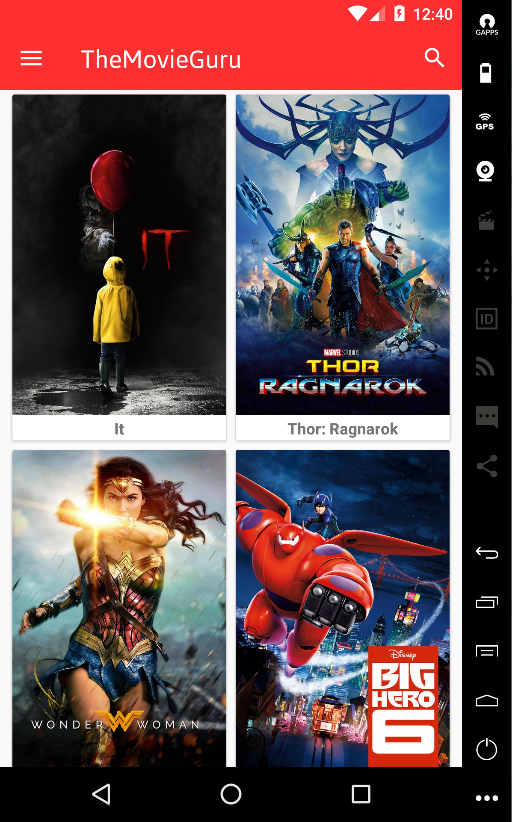
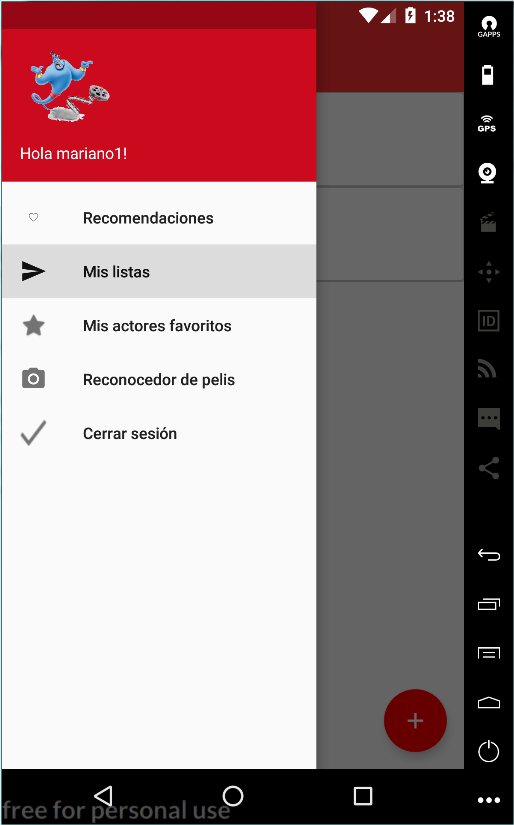
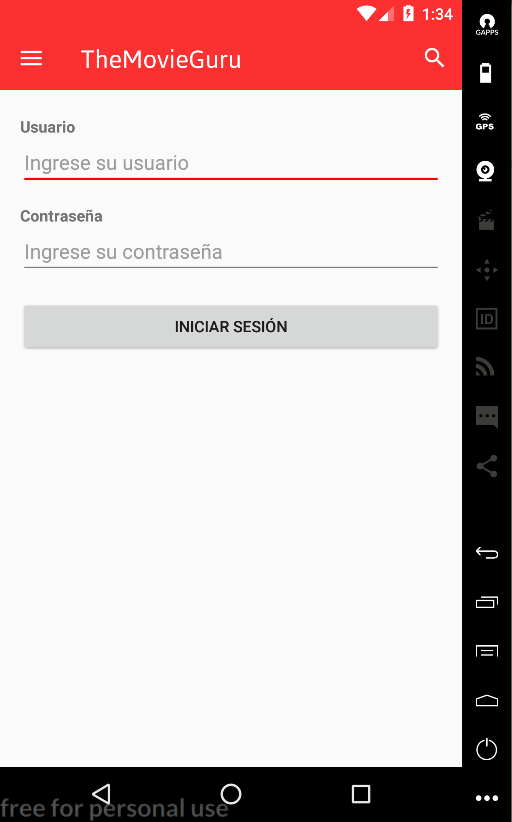
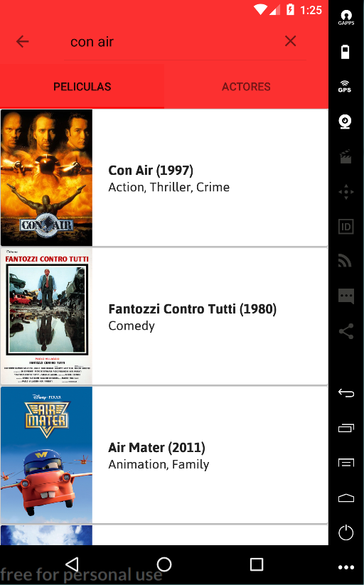
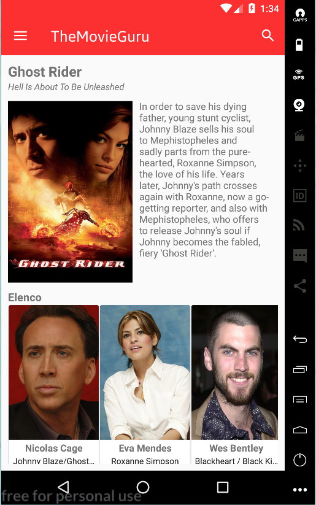
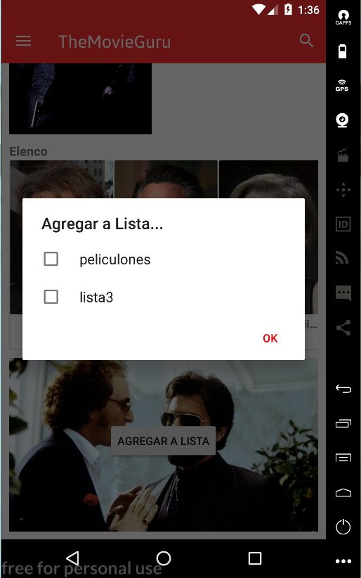
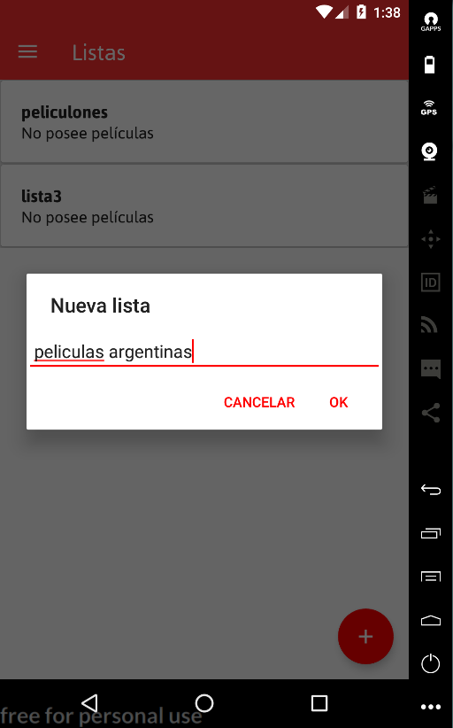

# TheMovieGuru
**TheMovieGuru** es una aplicación que permite a los usuarios interactuar con la API de The Movie Database, creando así una app con diversos casos de uso relacionados a las películas y actores provistos por la API.  

Con esta app vas a poder:

* Buscar películas y actores por nombre
* Poder crear una cuenta para guardar tus actores favoritos y tus listas.
* Ver el detalle de una película
  * Imágenes
  * Actores
  * Descripción
* Ver el detalle de un actor
  * Imágenes
  * Biografía
  * Películas donde trabajó
* Crear una lista de películas con un nombre
* Agregar películas a la lista
* Consultar dicha lista
* Marcar / desmarcar un actor como favorito
* Consultar quienes son tus actores favoritos

